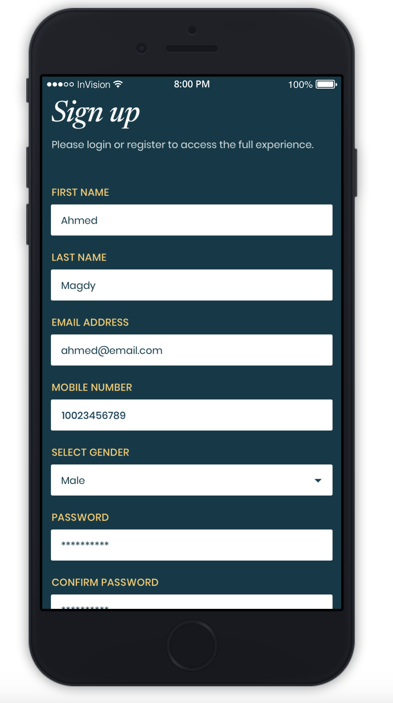
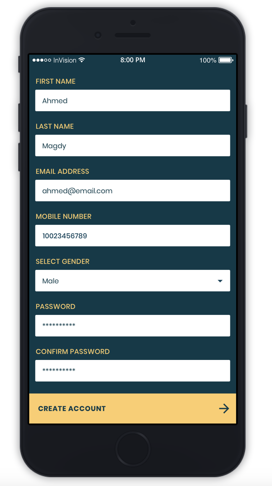
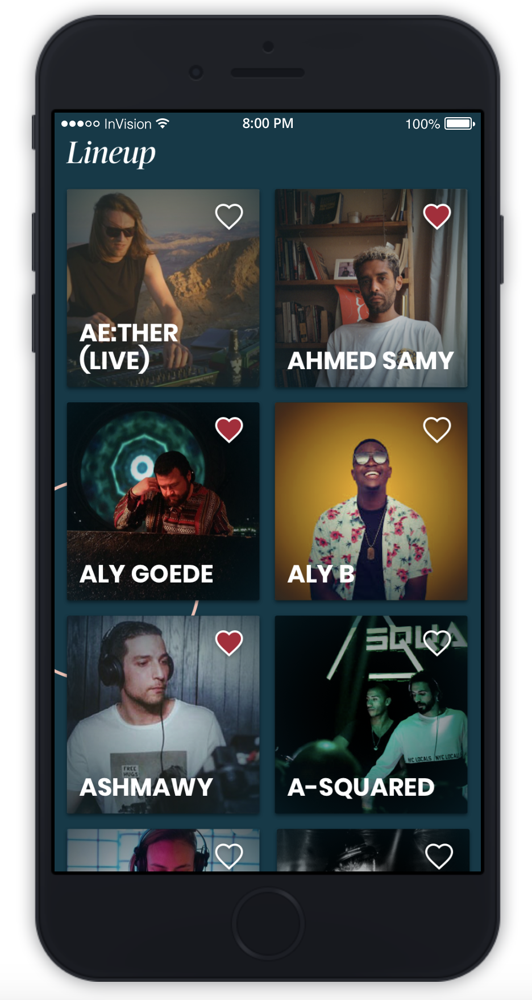
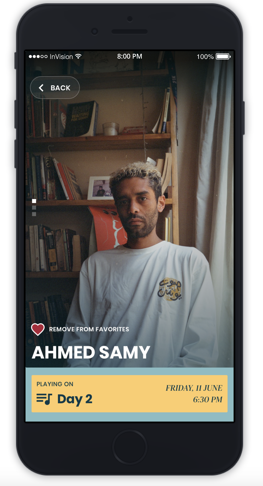
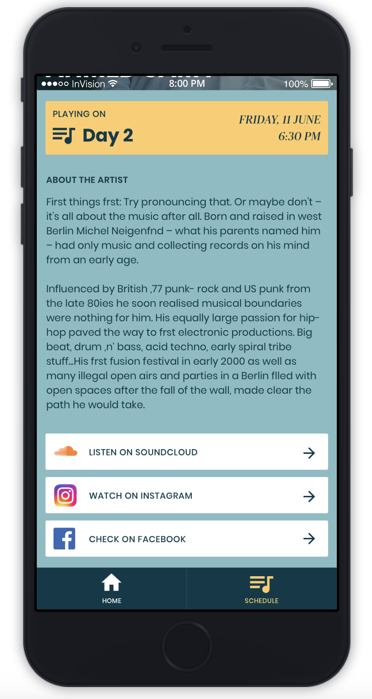
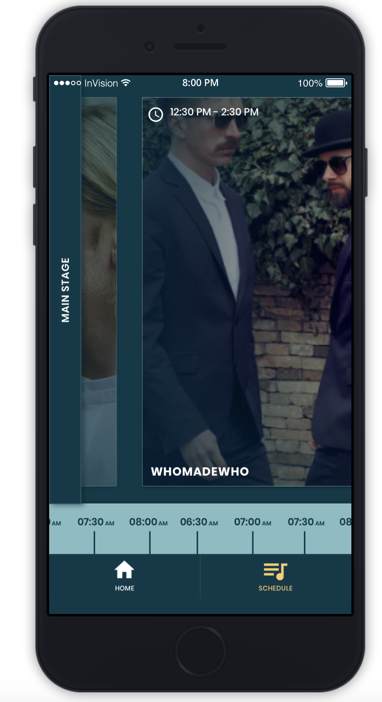

# Flutter-Challenge

Mobile developers face challenges almost everyday during development: performance, security, backwards compatibility, testing... And mainly refactoring for it's own or legacy code. This repository contains a project description to face a small challenge where the developer should build the app along with some new features, detect (and implement) patterns, add tests, and do a clean code.

This app uses an API to get data and preview it. Your challenge is to build the app however you see fit!

## Getting Started

Your task is to build an app that retrieves a list of some music artists from an API. The app has a signup page, a page for showing a list of the artists, the profile for each artist.

API URL: <a href="https://run.mocky.io/v3/4896603c-adcb-4be6-9328-d081553b1fe2">https://run.mocky.io/v3/4896603c-adcb-4be6-9328-d081553b1fe2</a>

This behaviour should be done in three diffent screens, one for signup, one for list and one for profile of the artist:

  
  
  
  
  

### Tasks

Your task as a Flutter Developer is to build your application, test and refactor your code before you give access to your repository.
You can use any state management tool that you prefer.

**Functionalities to be included**

1. Signup form with validation (no need to submit form, just access next screen)
2. Screen with 2 bottom tabs (artist/timeline)
3. Create a list of a artists displaying name, image and favorite status
4. Favoriting or unfavoriting an artist (works locally, reset when app is closed)
5. Artist profile includes name, image, favorite status, biography, social links

**Once you've finished**

- Notify by email to [joe.kaldas@ntsal.com](joe.kaldas@ntsal.com) with the link of the Github repo and a list of functionalities you implemented

### Bonus

- Add transitions between artist list and artist profile
- Create a screen for timeline
- Shows schedule by artist and corresponding time

